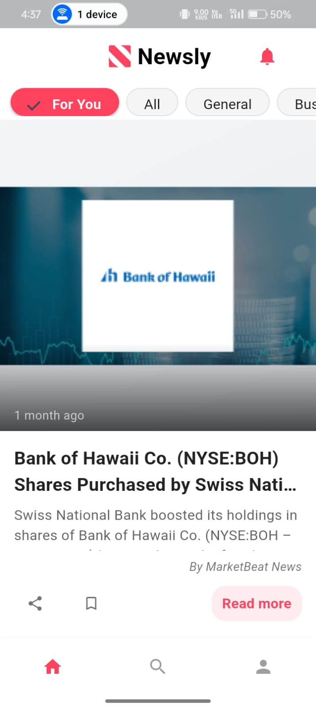
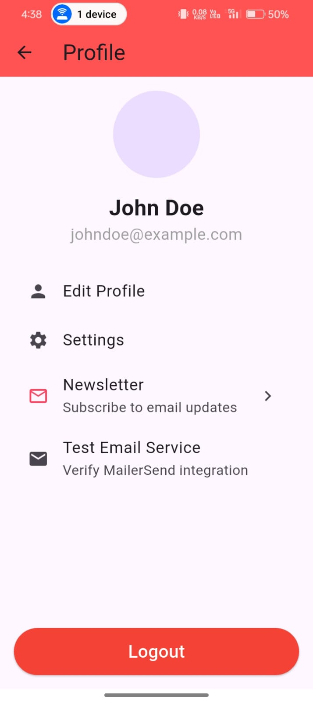
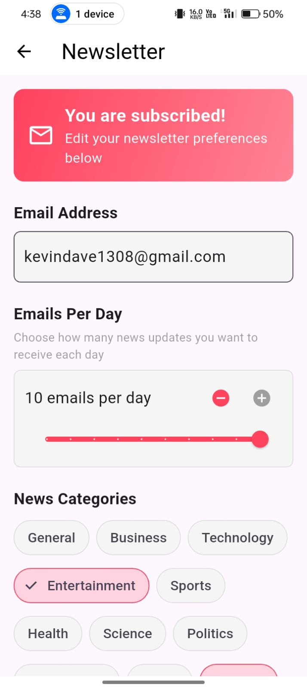

# 📰 Newsly – Personalized News App

**Newsly** is an intelligent, cross-platform mobile app that delivers personalized news articles based on your interests. Built with **Flutter**, **Supabase**, and **Python**, it leverages NLP techniques like **TF-IDF** and **Latent Semantic Analysis (LSA)** to provide content that actually matters to you — not just clickbait.

> “Don’t scroll endlessly — let Newsly serve you what you care about.”

---

## 🚀 Features

- 🔐 **Secure Auth** — Google Sign-In and Email/Password support via Supabase
- 🧠 **Smart Recommendations** — Based on content similarity using TF-IDF + LSA
- 📚 **Real-Time News Feed** — Articles updated dynamically from a Supabase backend
- 📩 **Email Delivery** — Get curated news sent directly to your inbox
- 🌐 **Responsive UI** — Smooth and consistent across Android, iOS, and Web

---

## 🛠️ Tech Stack

| Frontend    | Backend           | Intelligence Layer   |
|-------------|-------------------|-----------------------|
| Flutter/Dart| Supabase + Firebase | Python (NLP, LSA, TF-IDF) |

---

## 📸 Screenshots

<h2>📸 Screenshots</h2>

<h4>🚀 Splash Screen</h4>


<h4>🏠 Home Screen</h4>


<h4>🔍 Search Functionality</h4>


<h4>👤 Profile Page</h4>


<h4>✉️ Email Service</h4>


---

## 📦 Installation

```bash
# Clone the repo
git clone https://github.com/your-username/newsly.git
cd newsly

# Install dependencies
flutter pub get

# Run the app
flutter run
